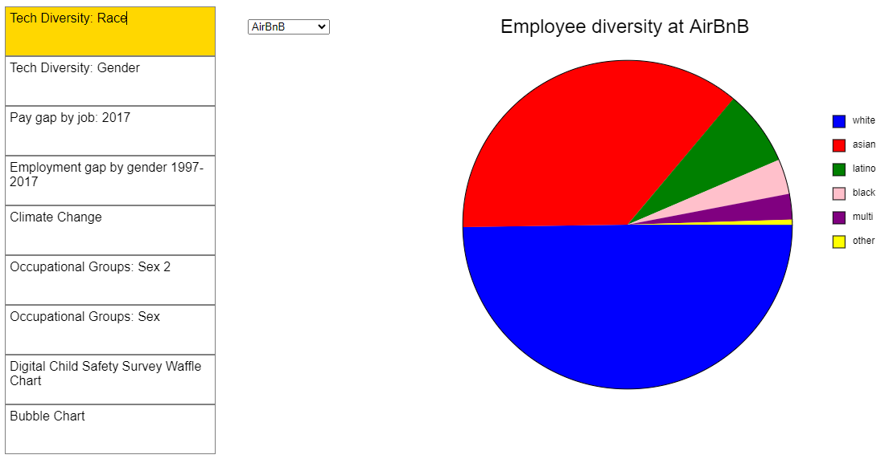
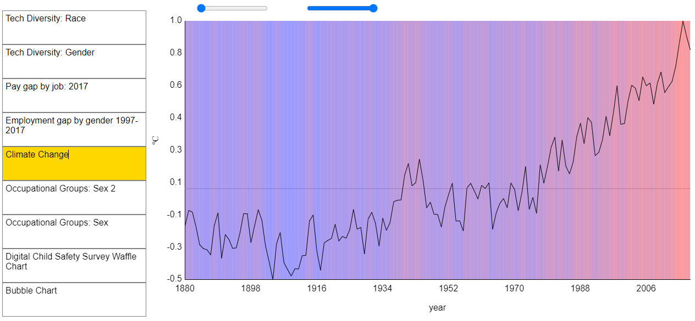
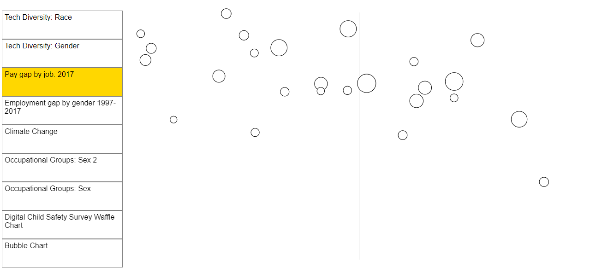
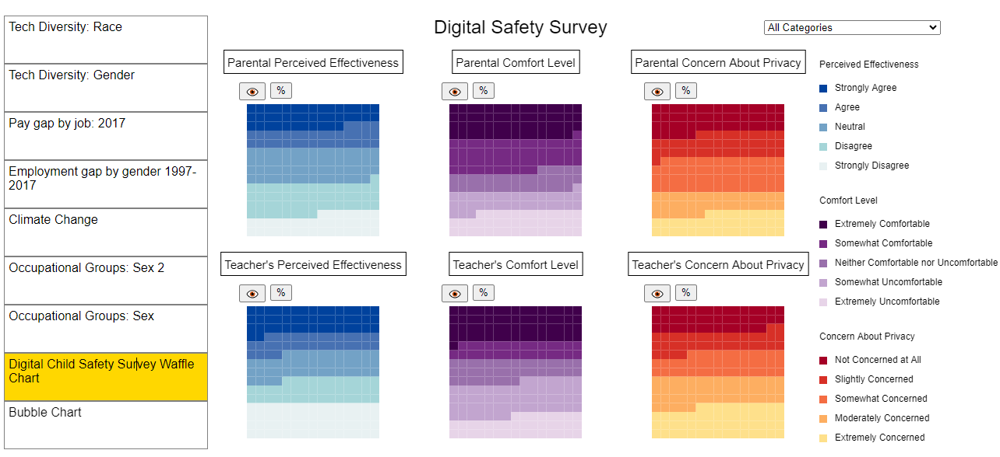

# Data Visualization Project

This project is a collection of interactive data visualizations developed to explore and analyze various datasets. The visualizations cover topics such as gender diversity in tech companies, pay gaps over time, and climate change. Additionally, custom visualizations such as a bubble chart and a waffle chart have been added to provide further insights into the data. This project demonstrates my skills in data visualization, JavaScript programming, and the use of the p5.js library.

## Table of Contents

- [Data Visualization Project](#data-visualization-project)
  - [Table of Contents](#table-of-contents)
  - [Overview](#overview)
  - [Visualizations](#visualizations)
    - [1. Tech Diversity: Gender (course template)](#1-tech-diversity-gender-course-template)
    - [2. Pay Gap 1997–2017 (course template)](#2-pay-gap-19972017-course-template)
    - [3. Climate Change (course template)](#3-climate-change-course-template)
    - [4. Tech Diversity: Race (course template)](#4-tech-diversity-race-course-template)
    - [5. Pay Gap by Job 2017 (course template)](#5-pay-gap-by-job-2017-course-template)
    - [6. Bubble Chart (my own extension)](#6-bubble-chart-my-own-extension)
    - [7. Waffle Chart(my own extension)](#7-waffle-chartmy-own-extension)
  - [Installation and Setup](#installation-and-setup)
  - [How to Use](#how-to-use)
  - [Project Structure](#project-structure)
  - [Technologies Used](#technologies-used)
  - [Credits](#credits)
    - [Special Thanks](#special-thanks)
  - [License](#license)

## Overview

This project showcases a series of interactive data visualizations designed to present complex data in an accessible and visually appealing manner. Each visualization is tailored to highlight key insights from the data, using a variety of chart types and interactive features.

## Visualizations

### 1. Tech Diversity: Gender (course template)
**Visualization Type:** Stacked Bar Chart  
**Description:** Visualizes gender diversity across prominent tech companies, displaying the proportion of male and female employees.  

**Implementation Highlights:**
- Data loaded from `gender-2018.csv`.
- Proportions of male and female employees represented as stacked bars.


### 2. Pay Gap 1997–2017 (course template)
**Visualization Type:** Line Graph  
**Description:** Shows the pay gap between male and female employees over 20 years, highlighting trends and changes.
.PNG)
**Implementation Highlights:**
- Data extracted from `all-employees-hourly-pay-by-gender-1997-2017.csv`.
- Pay gap plotted over time with custom y-axis mapping.

### 3. Climate Change (course template)
**Visualization Type:** Line Graph with Gradient Fill  
**Description:** Illustrates the change in Earth’s surface temperature over time, with a gradient background reflecting temperature changes.

**Implementation Highlights:**
- Temperature data mapped to color gradients for visual impact.
- Background created using rectangles for each year.

### 4. Tech Diversity: Race (course template)
**Visualization Type:** Pie Chart  
**Description:** Represents the racial diversity of employees at various tech companies.

**Implementation Highlights:**
- Dynamic dropdown for selecting companies.
- Pie chart updates based on the selected company, reflecting racial distribution.

### 5. Pay Gap by Job 2017 (course template)
**Visualization Type:** Scatter Plot  
**Description:** Displays the pay gap across different job roles, with the size of each point representing the number of jobs.

**Implementation Highlights:**
- Points mapped based on the proportion of female employees, pay gap, and job count.
- Interactive tooltips provide additional context for each data point.

### 6. Bubble Chart (my own extension)
**Visualization Type:** Interactive Bubble Chart  
**Description:** Represents sentiment values across different daycares with interactive filtering options.

**Implementation Highlights:**
- Bubbles positioned within predefined daycare circles.
- Clicking on daycare buttons filters the bubbles, showing only relevant data.
- Hover effects and tooltips provide detailed information.

### 7. Waffle Chart(my own extension)
**Visualization Type:** Waffle Chart  
**Description:** Visualizes categorical data in a grid format, providing an intuitive view of proportions.

**Implementation Highlights:**
- Grid cells represent percentage points.
- Categories are color-coded for easy differentiation.

## Installation and Setup

1. **Clone the Repository:**
   Clone the repository to your local machine using the following command:
   ```bash
   git clone https://github.com/your-username/data-visualization-project.git
   ```

2. **Navigate to the Project Directory:**
   Change the current directory to the project folder:
   ```bash
   cd data-visualization-project
   ```

3. **Install Dependencies:**
   Ensure that p5.js and p5.dom.js libraries are included in your HTML file. Add these scripts in the `<head>` section of your `index.html` file:
   ```html
   <script src="https://cdnjs.cloudflare.com/ajax/libs/p5.js/1.4.0/p5.js"></script>
   <script src="https://cdnjs.cloudflare.com/ajax/libs/p5.js/1.4.0/addons/p5.dom.js"></script>
   ```

4. **Run the Application:**
   Open the `index.html` file in your preferred web browser to view and interact with the visualizations.

## How to Use

- **Select Visualizations:** Use the dropdown menu in the application to switch between different visualizations.
- **Interact with Charts:** Hover over chart elements to view additional information. For bubble charts, click on the daycare buttons to filter data.
- **Switch Between Daycares:** In the bubble chart, click on a daycare button to update the displayed bubbles.

## Project Structure

- **index.html:** Main HTML file that loads the application.
- **sketch.js:** Initializes the canvas and manages global configurations.
- **tech-diversity-gender.js:** Implements the Tech Diversity: Gender visualization.
- **pay-gap-1997-2017.js:** Implements the Pay Gap 1997–2017 visualization.
- **climate-change.js:** Implements the Climate Change visualization.
- **tech-diversity-race.js:** Implements the Tech Diversity: Race visualization.
- **pay-gap-by-job-2017.js:** Implements the Pay Gap by Job 2017 visualization.
- **bubble.js:** Custom interactive bubble chart visualization.
- **waffle.js:** Custom waffle chart visualization.
- **data/:** Directory containing CSV data files used for the visualizations.

## Technologies Used

- **JavaScript:** For interactive data visualization and logic.
- **p5.js:** For creating the visual elements and handling user interactions.
- **p5.dom.js:** For handling DOM elements like dropdown menus and buttons.

## Credits

This project was developed as part of a data visualization course, with additional custom visualizations such as the bubble and waffle charts created to showcase my skills in interactive data presentation.

### Special Thanks
- **p5.js Library:** For providing a powerful yet simple framework for creative coding and interactive visualizations.
- **Course Instructors and Peers:** For guidance, feedback, and collaboration throughout the project.

## License

This project is licensed under the MIT License. You are free to use, modify, and distribute the code, provided you include the original copyright notice and this permission notice in all copies or substantial portions of the Software.
